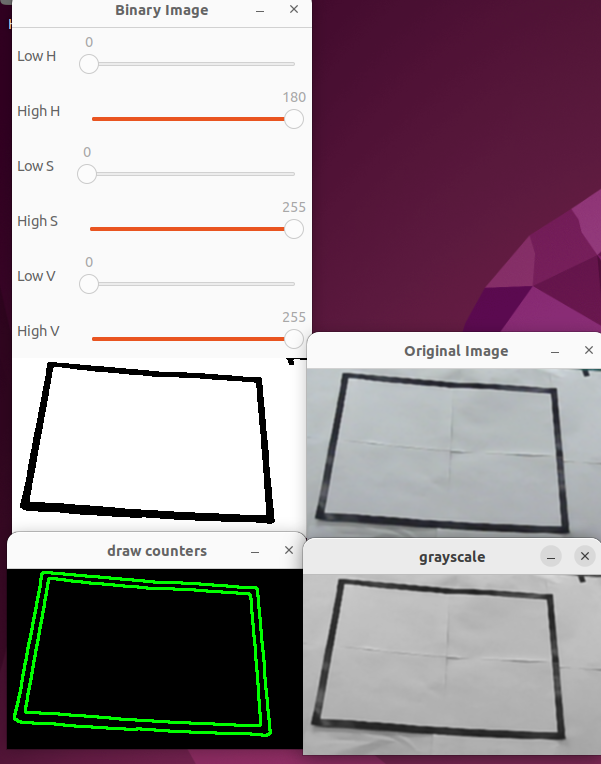

### 运行程序
```
./HSV_Filter /dev/video0 230
```

### 曝光的设定
设置的是正的值,电子系实验室下没有补光曝光值为230亮度适中
```
double exposure = 230;
exposure = std::stod(argv[2]);
cap.set(cv::CAP_PROP_AUTO_EXPOSURE, 3.0); // 先打开自动曝光
cap.set(cv::CAP_PROP_AUTO_EXPOSURE, 1.0); // 再关闭自动曝光
cap.set(cv::CAP_PROP_EXPOSURE, exposure); // 最后设置曝光参数
```


经过试验,从网上找来的demo的这种方法并没有效果
```
cap.set(cv::CAP_PROP_AUTO_EXPOSURE, 0.25);
double exposure = std::stod(argv[2]);
bool success4 = cap.set(cv::CAP_PROP_EXPOSURE, exposure);
```

设置回自动曝光
```
// manual exposure
cap.set(cv::CAP_PROP_AUTO_EXPOSURE, 0.25);
double exposure = std::stod(argv[2]);
bool success4 = cap.set(cv::CAP_PROP_EXPOSURE, exposure);
if (!success4) {
    std::cout << "无法设置曝光值" << std::endl;
    return -1;
}
```

### 第0版本demo
hsv阈值基本没有使用,仅仅使用阈值进行边缘检测效果

<div style="text-align: center;">
	
</div>

### @TODO
- ~~多边形拟合~~
- ~~```std::erase```面积过滤~~
- ~~使用边框点的具体坐标点的识别~~
- 串口通信
- 卡尔曼滤波
- 多线程

